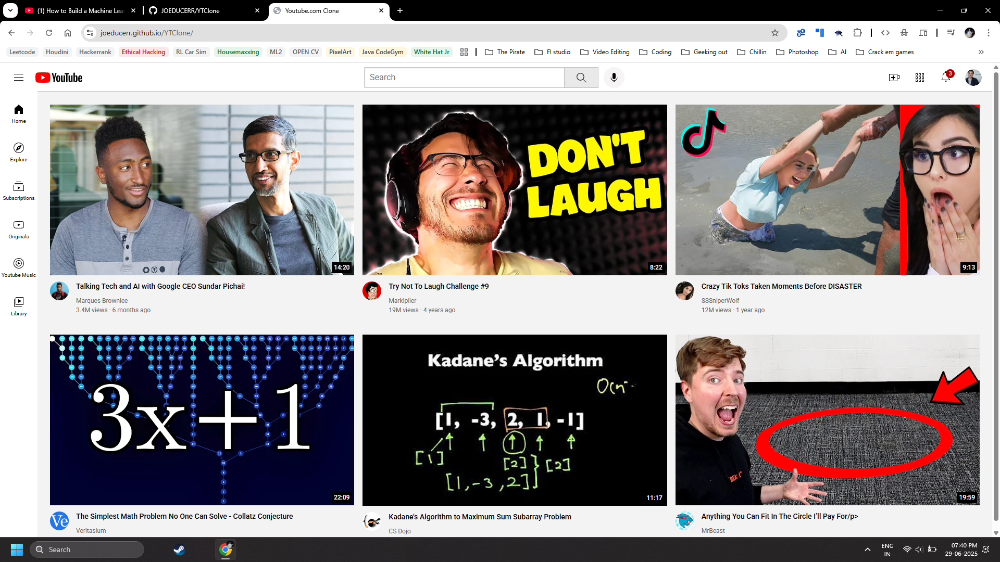

#YouTube Homepage Clone – YTClone

This project is a static front-end clone of the YouTube homepage built using HTML and CSS. It replicates the basic layout including the navigation bar, thumbnails, sidebar, and other UI elements—strictly for educational and practice purposes.

🔧Instructions:
1. Check if all the files are downloaded properly
2. Run Youtube.html using any browser of your choice
3. Enjoy the Youtube home page clone!

🚀YT Clone homepage:
Check out the hosted version here - https://joeducerr.github.io/YTClone/

For more info refer to the given link:
https://www.youtube.com/watch?v=G3e-cpL7ofc
(Credits : @SuperSimpleDev on Youtube)
